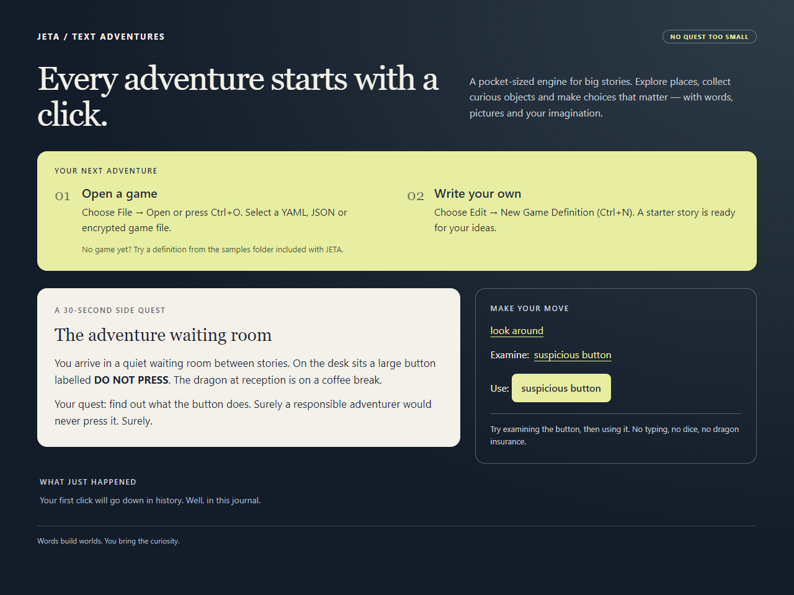
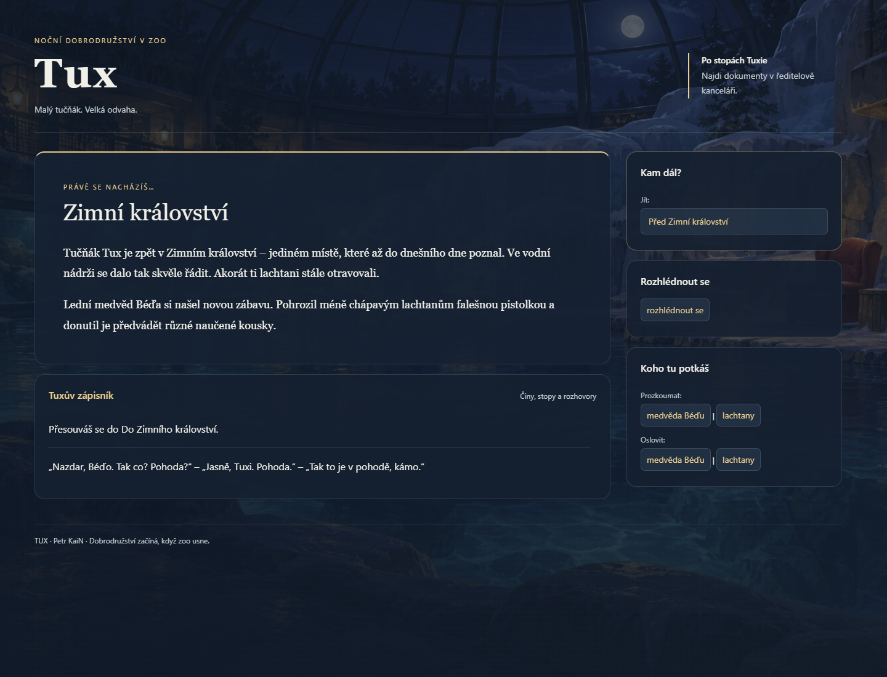
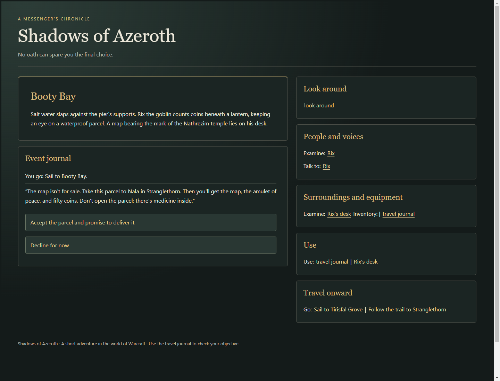

# JETA

**Javascript Engine for Text Adventures**

Play and create text adventures with clickable choices, illustrated locations,
branching conversations, and custom layouts. JETA is an Electron desktop app;
stories live in readable YAML or JSON files.

**[Download JETA 1.1.0 for Windows x64](https://github.com/dvdmchl/JETA-electronjs/releases/download/v1.1.0/JETA-1.1.0-Setup-x64.exe)**
· [Release notes](https://github.com/dvdmchl/JETA-electronjs/releases/tag/v1.1.0)
· [Game-authoring guide](docs/GAME_AUTHORING.md)



*The welcome adventure introduces the engine and explains your next step. It starts
in the application's selected language: English or Czech.*

## Start playing

### Windows

1. Download and run the Windows x64 installer above.
2. Launch JETA from the Start menu.
3. Choose **File > Open** (`Ctrl+O`) and select a game definition.

Electron and runtime dependencies are included; you do not need Node.js. Sample
games are in the installation's `samples` folder. Copy a sample's entire folder
to a writable location before editing it, keeping its layout and images beside
the definition.

The installer is unsigned, so Windows may display an unknown-publisher or
SmartScreen prompt. Releases include a SHA-256 checksum and build provenance JSON.
Uninstall through Windows Settings. Automatic application updates are not configured.

### From source

Clone this repository or extract a [source archive from a release](https://github.com/dvdmchl/JETA-electronjs/releases).
Install **Node.js 20 LTS** (see [.nvmrc](.nvmrc)), then run:

```sh
npm ci
npm start
```

Use the locked dependencies with `npm ci`. This project's Electron installation
is not compatible with Node.js 24. Windows x64 is the packaged and installer-tested
platform; Linux and macOS currently have no packaged installers.

## What you can build

- Locations connected by routes, including paths unlocked by story conditions.
- Objects to examine, take, use, and drop, with an inventory and contextual actions.
- Characters with branching conversations and clickable responses.
- Variables, conditions, assignments, and multiple endings.
- Local images and custom HTML/CSS layouts with configurable section visibility.
- Optional game translations that switch text while preserving progress.
- Serializable game state and optional encrypted game files.

The engine validates game definitions and checks IDs and references before play.
The [authoring guide](docs/GAME_AUTHORING.md) describes supported mechanics,
narrative markup, game-folder assets, translation maps, and validation checks.

## Try the included adventures

Open these definitions with **File > Open** (`Ctrl+O`):

| Adventure | Language | What to expect |
| --- | --- | --- |
| [Tux](samples/Tux/Tux.yaml) | Czech | A penguin's nighttime zoo adventure, puzzles, and illustrated backgrounds for eleven locations. |
| [Shadows of Azeroth / Stíny Azerothu](samples/stiny_azerothu/stiny_azerothu.yaml) | Czech and English | A delivery quest, branching dialogue, an elemental rune puzzle, and three endings. |
| [Test](samples/test/Test.yaml) | Czech | A small demonstration of objects, actions, dialogue, conditions, images, and a custom layout. |



*Tux's custom layout keeps the story readable over its nighttime zoo illustrations.
See the [Tux sample guide](samples/Tux/README.md) for its layout and assets.*



*Shadows of Azeroth demonstrates branching dialogue and a shared Czech/English
story. Its [sample guide](samples/stiny_azerothu/README.md) includes a walkthrough.*

### Application language and game language

**Edit > Language** selects the application language. The welcome adventure uses
that setting when JETA starts. Each opened game starts in the language declared
by its definition.

For games with translations, **File > Game language** switches the current story
without restarting it. Location, inventory, decisions, and active dialogue are
preserved. Existing journal entries keep the language in which they were written.
Game text and application menus are independent.

## Create your own adventure

Choose **Edit > New Game Definition** (`Ctrl+N`) or copy the
[game definition template](resources/game_definition_template.yaml) into a new
folder. Keep any images and custom layout in that folder, open the definition in
JETA, and play through every route as you edit. Saving an opened definition reloads
it as a fresh game.

Read the [game-authoring guide](docs/GAME_AUTHORING.md) before creating or generating
a game. It includes an AI authoring workflow and a play-test checklist. The
[JSON schema](resources/game_definition_schema.json) defines the supported shape;
the loader also checks unique IDs and references. Schema validation and play-testing
are both necessary.

## Development

Use Node.js 20 and install from the lockfile:

```sh
npm ci
npm run test:ci
npm start
```

`npm test` runs Jest; `npm run test:ci` runs the same suite sequentially for CI.
Tests live in `src/test/`; `out/` is generated output.

[AGENTS.md](AGENTS.md) is the canonical development guidance for coding agents.
[GEMINI.md](GEMINI.md) imports it so Codex and Gemini follow the same rules.
The [dependency review](docs/DEPENDENCY_REVIEW.md) records the 1.1.0 dependency
refresh and remaining security findings; updating within existing version ranges
does not resolve every advisory or replace the planned runtime/toolchain migration.

## Building and publishing releases

On Windows with Node.js 20, build the x64 NSIS installer with:

```sh
npm ci
npm run dist:win
```

Output is written to `out/release/`. In a clean test account, verify installation,
startup, and uninstallation using the version from `package.json`:

```powershell
$version = (Get-Content package.json -Raw | ConvertFrom-Json).version
./src/test/windows-installer-smoke.ps1 -InstallerPath "./out/release/JETA-$version-Setup-x64.exe"
```

The **Windows installer** GitHub Actions workflow builds and tests newly published
releases, then attaches the installer, checksum, and provenance. For an existing
release, it can be dispatched with `release_tag`; the package version must match,
and existing assets are never overwritten. Supplemental packaging builds must
identify their exact build commit in the release notes and provenance.

Use the project [jeta-release skill](.agents/skills/jeta-release/SKILL.md) for version
synchronization, tests, installer verification, CI, annotated tags, and publication.
Ask Codex to use `$jeta-release` to release a version.
